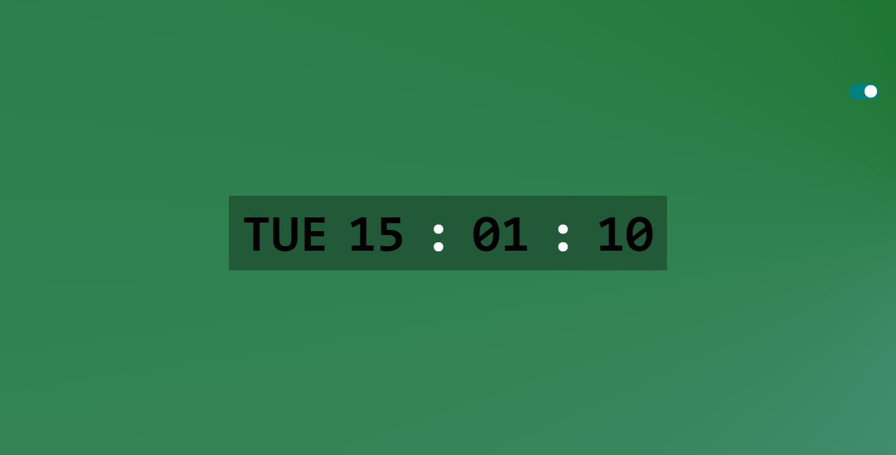

# Digital Clock

This is a simple digital clock web application built with JavaScript.

## Description

The Digital Clock web app displays the current time, including the day, hour, minute, and second. The clock automatically updates every second.

## Installation

There is no installation required for this web app. Simply open the `index.html` file in your web browser to run the Digital Clock.

## Usage

Once the Digital Clock is running, it will display the current time in a digital format. The clock also features a toggle button that changes the appearance of the clock when clicked.

## Features

- Displays the current time (day, hour, minute, and second)
- Toggle button to change the clock's appearance
- Background gradient transitions

## Examples

Here are some screenshots of the Digital Clock:

## Contact

For any inquiries or feedback, please email me at donfranklie@gmail.com.

## Repository

You can find the source code for the Digital Clock in the following repository: [Digital Clock Repository](https://github.com/DonFranklie/digital-clock)
